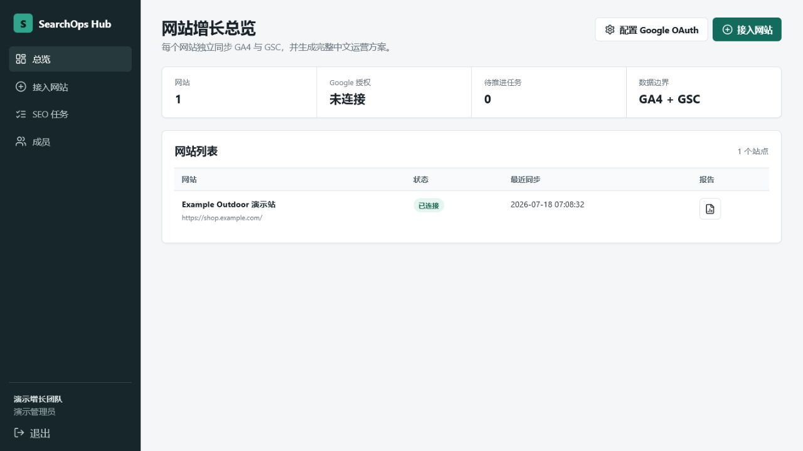

# SearchOps Hub

SearchOps Hub 是一个面向独立站团队的开源多租户 SEO 运营平台。它连接 Google Analytics 4 和 Google Search Console，把搜索表现、页面行为、技术 SEO 证据和 AI 内容建议整合成可执行的中文运营方案。



> 仓库中的品牌、域名、指标和截图均为虚构演示数据。项目不包含任何真实网站数据、OAuth 凭据、数据库连接串或 API Key。

## 核心能力

- 多租户工作区、成员管理和严格的 `tenant_id` 数据隔离
- Google OAuth 2.0，只申请 GA4、Analytics Admin 和 GSC 只读权限
- GA4 渠道、落地页、国家、语言、设备和交叉维度分析
- GSC 查询、页面、国家、设备、查询 × 页面和搜索外观分析
- 7、28、90 天及自定义日期的同周期对比
- 页面级 WordPress SEO 审计与多语言 AI 优化建议
- 多语言 Embedding、TF-IDF、实体和搜索意图驱动的关键词蚕食检测
- SEO 任务中心、历史报告、CSV 导出和打印视图
- Google OAuth 令牌 AES-256-GCM 加密、CSRF 防护和页面审计 SSRF 防护
- 生产环境内部访问码和邮箱域名白名单注册限制

## 五分钟本地体验

环境要求：Node.js 22 或更高版本。

```bash
git clone https://github.com/paulrose4/searchops-hub.git
cd searchops-hub
npm ci
cp .env.example .env
npm start
```

Windows PowerShell：

```powershell
git clone https://github.com/paulrose4/searchops-hub.git
Set-Location searchops-hub
npm ci
Copy-Item .env.example .env
npm start
```

打开 <http://localhost:3210>，使用本地演示账号：

- 邮箱：`demo@example.com`
- 密码：`demo12345`

开发环境默认使用本地 SQLite 和虚构的户外用品演示数据，无需配置 Google、PostgreSQL 或 AI Key。

## 文档

- [完整部署指南](docs/DEPLOYMENT.zh-CN.md)
- [Windows 局域网部署指南](docs/LAN_DEPLOYMENT.zh-CN.md)
- [Google OAuth 与 GA4/GSC 配置](docs/GOOGLE_OAUTH.zh-CN.md)
- [演示说明与截图](docs/DEMO.zh-CN.md)
- [安全策略](SECURITY.md)
- [贡献指南](CONTRIBUTING.md)

## 配置概览

复制 `.env.example` 为 `.env`。以下能力均为可选：

| 能力 | 所需变量 |
| --- | --- |
| 本地演示 | 无，默认 SQLite + 演示账号 |
| GA4/GSC | `GOOGLE_CLIENT_ID`、`GOOGLE_CLIENT_SECRET` |
| AI 页面优化 | `OPENAI_API_KEY`、`OPENAI_BASE_URL`、`OPENAI_MODEL` |
| 多语言 Embedding | `OPENAI_EMBEDDING_MODEL` 等 Embedding 配置 |
| PostgreSQL | `DATABASE_URL` |
| 生产注册限制 | `REGISTRATION_ACCESS_CODE` 或 `REGISTRATION_ALLOWED_DOMAINS` |

密钥只能保存在服务器环境变量中。不要把 `.env`、数据库文件、OAuth Secret、API Key 或生产域名提交到 Git。

## 数据边界

系统只使用 GA4、Google Search Console 和绑定域名的公开网页，不接入订单、广告花费或用户级分析数据。AI 仅接收公开页面内容和当前租户的汇总 SEO 证据，不接收 OAuth 令牌、密码或其他租户数据。

系统输出的是运营建议，不会自动修改 WordPress 内容，也不承诺排名、流量或商业结果。

## 开发验证

```bash
npm run check
npm test
```

## 技术栈

- Node.js 22、Express 5
- SQLite（本地）或 PostgreSQL/pgvector（生产）
- Google Analytics Data API、Analytics Admin API、Search Console API
- OpenAI-compatible Responses 或 Chat Completions API
- 服务端渲染 HTML、原生 JavaScript 和 CSS

## License

[MIT](LICENSE)
