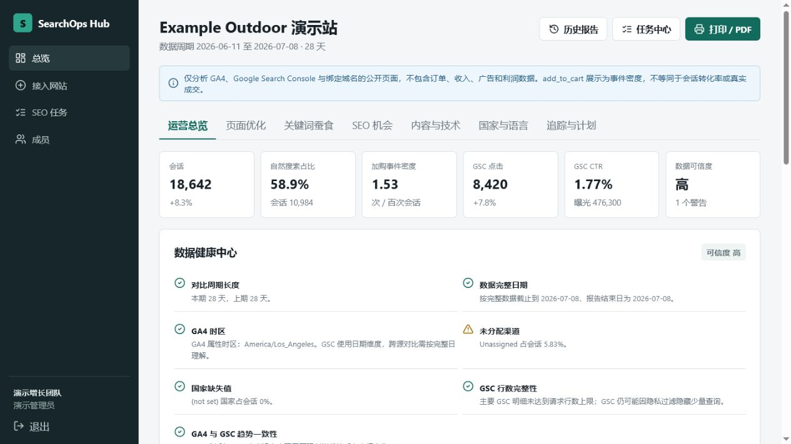

# 项目演示

演示环境使用完全虚构的 `Example Outdoor` 户外用品站和 `shop.example.com` 域名，不包含真实网站、用户或业务数据。

## 启动演示

```bash
npm ci
cp .env.example .env
npm start
```

打开 <http://localhost:3210>：

- 邮箱：`demo@example.com`
- 密码：`demo12345`

## 演示数据文件

可直接查看或用于二次开发：

- [`examples/demo-snapshot.json`](../examples/demo-snapshot.json)：GA4、GSC、页面审计和多语言市场的完整虚构快照。
- [`src/demo.js`](../src/demo.js)：应用启动时使用的演示数据生成器。

## 演示场景

### 1. 增长总览


查看自然搜索会话、GSC 点击、曝光、CTR、平均排名和数据健康状态。

### 2. 多维度市场诊断



按国家、语言、设备、查询和落地页定位增长机会。演示站包含英语、德语和法语市场。

### 3. SEO 执行工作流

报告会把证据转成页面优化建议和任务。页面 AI 功能只有在服务器配置了兼容 API Key 后才启用；没有 Key 时仍可使用规则诊断和演示报告。

## 演示数据边界

- 所有域名均属于 `example.com` 保留示例域名。
- 所有指标均为人工构造。
- 不包含订单、收入、广告花费或用户级数据。
- 截图不包含真实品牌、成人内容、凭据或个人信息。
